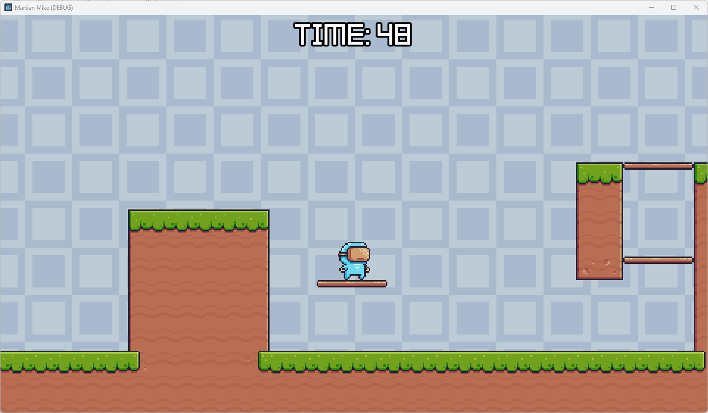

# Martian Mike
 
First game used the Godot Engine. Simple demo of platformer game. Include physical and sounds. This project based on Udemy course: https://www.udemy.com/course/complete-godot-4-game-developer-2d-online-course/

## Builds
If you want you can download current version of build here: https://drive.google.com/drive/folders/1V5q1gQ5IVDFPopJ296s4OqQeyt_Vo88y?usp=drive_link

## Full Playthrough Movie
Available here: https://drive.google.com/file/d/14uh5b6gcDX5PtjRtedeXvGI29zOiIukR/view?usp=drive_link

## Screenshots
All screenshots from current version are available here: https://drive.google.com/drive/folders/1GZ852AjZ401ryrmqgQEch9fmiO7lm3p1?usp=drive_link

### Level 1

### Level 2

### Level 3

### Level 4
